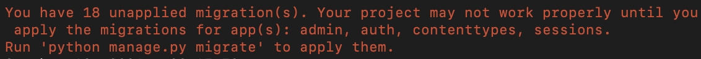

# DjangoProject
This project is completed as a part of a training program

## Virtual Environment
    - python3 venv -m myvenv
    - source myvenv/bin/activate

## Install Django
    - python3 -m pip install Django

## Initializing a Django project
    - django-admin startproject LoginSystem

## Creating a new app
    - cd LoginSystem
    - python manage.py startapp Loginify
    - Register the new app in the INSTALLED_APPS in settings.py of LoginSystem

## Migration Errors
    - When ran the server for the first time, the following errors will occur
      as we need to migrate the configurations.
      